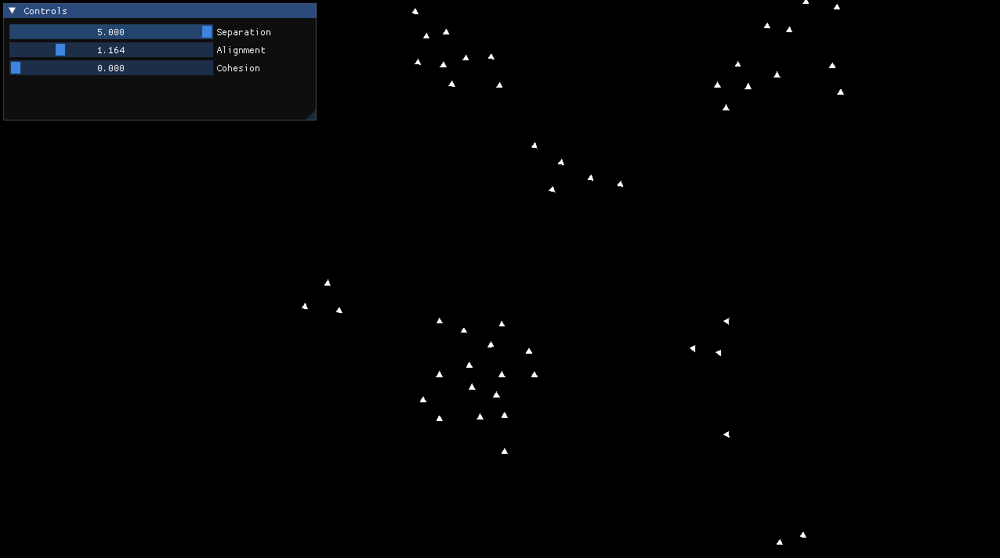

# 🚁 Drone Boids Simulator

  

## 📝 Overview
This project is an interactive 2D physics simulation of flocking behavior, modeled after Craig Reynolds' classic Boids algorithm. It simulates a swarm of autonomous drones navigating a shared environment without centralized control.

By applying simple, localized rules to individual entities, the software demonstrates how complex, organic, and emergent behaviors—resembling schools of fish or flocks of birds—can be generated. It includes a real-time control interface allowing users to manipulate the physical laws governing the swarm.

## 🚀 Key Features
- **Boids Algorithm**: Complete mathematical implementation of the three fundamental steering behaviors:
    - **Separation**: Drones actively steer to avoid crowding local flockmates (maintaining personal space).

    - **Alignment**: Drones adjust their velocity to match the average heading of nearby neighbors.

    - **Cohesion**: Drones steer towards the geometric center of mass of their local group.
- **Real-Time Control Panel**: An integrated interactive GUI that allows operators to tweak the weights of individual forces on the fly and immediately observe the physical impact on the swarm.

- **Robust Vector Math**: Custom 2D vector system handling velocity limits, acceleration capping, and smooth rotational tracking.

- **Self-Contained Architecture**: Employs modern dependency management to automatically fetch and build all required libraries from the source, eliminating local setup friction.

## 🛠️ Tech Stack
- **Language**: `C++ 20`
- **Libraries & Tools**:
    - `SFML 3.0` - Hardware-accelerated 2D graphics rendering and window management.
    - `Dear ImGui` - Immediate mode graphical user interface for the control panel.
    - `CMake` - Cross-platform build system and dependency management
